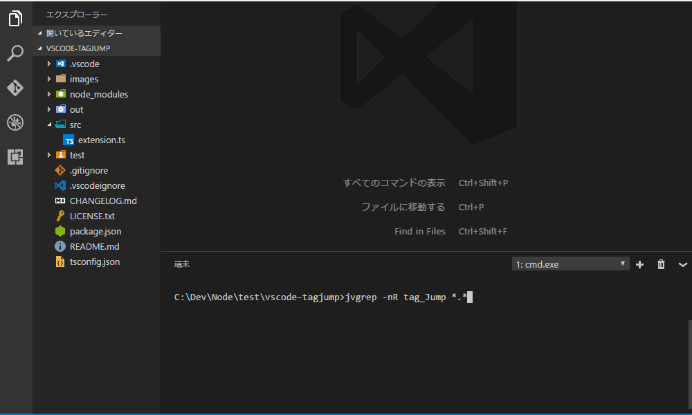

# Tag-Jump extension for Visual Studio Code 

Tag-Jump は Tag 情報により素早く目的のファイルを開きます。
Grep の検索結果やデバッグログ・コンパイラのメッセージから目的のファイルを開き効率的に作業ができます。

<!-- エディタのカーソル(キャレット)行にファイル名のが記述されている時、Tag-Jump 機能により記述されているファイルを開くことができます。-->

## Usage

## Features

### 現在 Tag-Jump がサポートしている tag 情報です。

1. Tag情報仕様はエディタの先頭行からファイル名が始まり、ファイル名の直後に：(コロン/colon)を配置することでファイル名とします。
1. そして：(コロン/colon)直後に数値を配置することで行番号とします。
1. 行番号の直後にはスペースを配置することで tag 情報と認識します。
1. 基本的な Tag情報仕様は上記ですが、利便性を高めるための実装がされています。

ファイル名の後に：(コロン/colon)、スペース、改行の場合ファイル名とします
* \<path-filename\>\<space or CR or LF\>
* ex) readme.txt  , readme.txt: 

ファイル名の前にスペース、タブは無視します
* ^\<space or tab\>\<path-filename\>:\<line-number\>\<space\>
* ex) space or tab readme.txt:10

ファイル名の先頭に'~'(チルダ)を指定すると環境変数 HOME をベースディレクトリとしてファイルの存在をチェックします
* \<~\>\<path-filename\>\<space\>
* ex) ~readme.txt, ~readme.txt:10 

ファイル名の先頭に'/'(スラッシュ)を指定するとフルパス名が与えられたとしてフルパス名でファイルの存在をチェックします
* \</\>\<path-filename\>\<space\>
* ex) /C:\path\readme.txt, /C:\path\readme.txt:10, /tmp/file.txt, /usr/local/share/file.txt 

## Requirements

* Tag-jump が動作する時は、Tag情報が書かれているファイルのディレクトリを基準としています、従ってディレクトリ位置が参照できない時は動作できません。
* Untitled-1 な編集作業時は Tag-Jump は機能しません、しかしワークスペースが設定されていた場合は基準ディレクトリをワークスペースを参照して動作します。

## Extension Settings

## Known Issues

## License

MIT

## Release Notes

### 0.0.1

Initial release of ...

**Enjoy!**